# Plan d'implémentation

*Document de conception · 7 octobre 2026*

Une page unique en HTML, CSS et JavaScript natifs, sans framework ni étape de build : le soin visuel prime sur la robustesse du code.

## Approche

Un fichier HTML, des modules ES chargés à la demande, zéro dépendance : le projet se lit et se déploie tel quel.

- **Pas de build.** Modules ES natifs (`<script type="module">`). En local, un serveur statique suffit (`npx serve`), car les modules ne se chargent pas en `file://`.
- **Un module par écran**, chargé avec `import()` au moment du saut : le joueur ne télécharge que l'époque qu'il visite.
- **Rendu en DOM, CSS et SVG.** Textes nets à toute taille, animables en CSS. Canvas réservé aux particules de l'écran final.
- **Un thème par époque** en variables CSS, activé par un attribut `data-era` sur `<body>`.
- **Sons synthétisés** avec Web Audio : aucun fichier audio protégé, poids quasi nul.
- **Raccourcis de dev.** `?screen=5` ouvre directement un écran, `?debug` affiche les solutions : indispensable pour itérer vite.
- **Hors périmètre assumé.** Tests unitaires, vieux navigateurs, traduction.
- **Hébergement.** Statique (Netlify ou équivalent), sans back-end.

## Architecture

Quatre couches, de la page aux composants partagés : un écran n'est qu'un module qui assemble des briques existantes. Trois composants partagés portent neuf écrans sur dix.

```mermaid
flowchart TB
    page["Page et HUD<br/>index.html, écran titre, frise des 10 époques,<br/>carnet, bouton indice, son"]

    subgraph moteur["Moteur"]
        direction LR
        router["Routeur<br/>charge chaque écran à la demande"]
        state["État<br/>carnet, indices, chrono, sauvegarde"]
        jump["Saut temporel<br/>extinction, compteur, métamorphose du cadre"]
        audio["Audio<br/>sons synthétisés en Web Audio"]
    end

    subgraph ecrans["Écrans, un module chacun"]
        direction LR
        s0["0 · Cartes<br/>gestes"]
        s1["1 · Unix<br/>terminal"]
        s2["2 · DOS<br/>terminal"]
        s3["3 · Win 3.1<br/>fenêtres"]
        s4["4 · Win 95<br/>fenêtres"]
        s5["5 · Win 98<br/>fenêtres"]
        s6["6 · XP<br/>fenêtres"]
        s7["7 · Ubuntu<br/>terminal + fenêtres"]
        s8["8 · Mobile<br/>gestes"]
        s9["9 · Agent<br/>interface propre"]
    end

    subgraph composants["Composants partagés"]
        direction LR
        term["Terminal<br/>saisie, sorties tapées,<br/>mode papier, sans écho"]
        win["Fenêtres<br/>déplacer, superposer,<br/>réduire, double-clic"]
        gest["Gestes<br/>glisser, réordonner (FLIP),<br/>glissière, pincement"]
    end

    page -->|démarre| moteur
    moteur -->|monte à la demande| ecrans
    ecrans -->|s'appuient sur| composants

    classDef terminal fill:#e3f0fd,stroke:#2b6cd4,color:#111
    classDef fenetres fill:#fdeae3,stroke:#e2622f,color:#111
    classDef gestes fill:#e2f5ee,stroke:#1a9e6e,color:#111
    class term,s1,s2 terminal
    class win,s3,s4,s5,s6 fenetres
    class gest,s0,s8 gestes
```



La couleur de chaque écran indique le composant partagé qu'il utilise ; Ubuntu combine terminal et fenêtres, et l'écran 9 a sa propre interface de conversation.

**Arborescence**

```text
escape-os/
├── index.html
├── css/
│   ├── base.css          tokens, HUD, cadre matériel
│   ├── crt.css           effets cathodiques
│   ├── jump.css          saut temporel
│   └── eras/             un thème par époque (cards.css … agent.css)
├── js/
│   ├── main.js           démarrage, paramètres ?screen= et ?debug
│   ├── core/
│   │   ├── router.js     montage des écrans, import() à la demande
│   │   ├── state.js      état, carnet, indices, localStorage
│   │   ├── jump.js       séquence du saut temporel
│   │   ├── audio.js      synthèse Web Audio
│   │   └── hud.js        frise, carnet, bouton indice
│   ├── ui/
│   │   ├── terminal.js
│   │   ├── windows.js    gestionnaire de fenêtres
│   │   └── gestures.js   glisser, FLIP, glissière, pincement
│   ├── screens/          00-cards.js … 09-agent.js
│   └── data/
│       └── facts.js      fiches « Le saviez-vous ? » et indices
└── assets/
    ├── fonts/
    └── svg/              icônes et pointeurs pixel art
```

## Direction artistique

La signature visuelle : un cadre matériel qui se métamorphose à chaque saut, des écrans reconstitués au pixel près, et une interface de voyage moderne qui ne change jamais.

**Le cadre qui évolue.** Le matériel autour de l'écran est dessiné en CSS : salle machine, télétype, moniteur cathodique beige (DOS à 98), écran plat (XP, Ubuntu), téléphone, puis plus aucun cadre en 2026. Taille, `border-radius`, couleur et épaisseur transitionnent en CSS pendant le saut : c'est le moment « waouh » du projet.

**L'interface du voyageur.** Un HUD discret et contemporain, identique partout : frise des 10 époques, année courante, carnet, bouton indice, son. Son style 2026 (une seule couleur d'accent, police Inter) fait ressortir les écrans rétro par contraste.

**Effets cathodiques, en CSS seul.**

- Lignes de balayage : `repeating-linear-gradient` en surimpression.
- Vignettage et léger bombé : `radial-gradient` et ombre interne.
- Lueur du phosphore : `text-shadow` de la couleur du texte.
- Scintillement : animation d'opacité très faible, coupée si `prefers-reduced-motion`.
- Extinction : l'image se réduit à une ligne, puis à un point qui s'éteint.

**Fidélité par époque.** Palette 16 couleurs VGA pour DOS, biseaux Windows en `box-shadow` inset, dégradés arrondis pour XP, icônes brillantes façon 2007, aplats et flous doux pour 2026. Icônes et pointeurs (flèche, sablier) redessinés en SVG pixel art, avec `shape-rendering: crispEdges`.

**Typographies libres.**

- Cartes et télétype : Courier Prime (OFL, Google Fonts).
- DOS : Px437 IBM VGA, de l'Ultimate Oldschool PC Font Pack (CC BY-SA 4.0, crédit à prévoir).
- Windows 3.1 à 98 : une police bitmap sans-serif libre façon MS Sans Serif, licence à vérifier avant usage.
- XP et Ubuntu : DejaVu Sans, Tahoma si le système l'a.
- Smartphone : pile Helvetica Neue puis police système.
- HUD et 2026 : Inter (OFL).

**Son.** Synthèse Web Audio : cliquetis du télétype (bruit filtré), bip DOS (onde carrée), poignée de main du modem (tonalités et bruit), Wizz, carillons originaux. Activé au premier clic, coupé en un geste.

**Références et garde-fou.** 98.css et XP.css (licence MIT) sont utiles pour étudier les biseaux, mais les styles maison sont ce que le portfolio doit montrer. Aucun logo, fond d'écran ni son d'origine : des recréations « dans l'esprit ».

## Composants partagés

Six briques réutilisées concentrent l'essentiel du code ; chaque écran se résume ensuite à un décor et un scénario.

- **Contrat d'écran.** Chaque module exporte `{ id, era, year, mount(root, ctx) }`, et `mount` renvoie une fonction de nettoyage. `ctx` fournit `complete()`, `error()`, `note(texte)`, `audio` et `hints`.
- **Terminal** (Unix, DOS, Ubuntu). Un vrai `<input>` invisible capte la saisie et ouvre le clavier sur mobile. Options : invite, sensibilité à la casse, vitesse de frappe des sorties, mode « papier » où rien ne s'efface. Historique aux flèches, sorties annoncées aux lecteurs d'écran via `aria-live`. Chaque écran fournit sa table de commandes `{ nom: (args) => sortie }`.
- **Gestionnaire de fenêtres** (Windows 3.1 à XP, Ubuntu). Déplacement par la barre de titre en Pointer Events (souris et doigt), mise au premier plan, réduction. Double-clic via `dblclick`, plus une détection du double tap au tactile.
- **Gestes** (cartes, smartphone). Glisser-déposer en Pointer Events, l'API Drag and Drop HTML5 étant inutilisable au tactile. Réordonnancement animé par la technique FLIP. Pincement : distance entre deux pointeurs au tactile, événement `wheel` avec `ctrlKey` pour le trackpad, boutons +/− en secours.
- **Saut temporel.** Une suite de promesses : extinction cathodique, compteur d'années façon odomètre, métamorphose du cadre, démarrage de l'époque suivante (texte du BIOS, barre de chargement). Chaque étape se passe d'un clic.
- **État, carnet, indices.** Un objet unique sauvegardé dans `localStorage` : écran courant, notes, chrono, indices et erreurs par écran. Le moteur d'indices relance un minuteur de 60 s à chaque progrès et compte les erreurs.

## Écran par écran

Ce que chaque écran doit montrer, la technique qui le porte et le piège à anticiper.

| # | Écran | Rendu visuel | Technique clé | Point délicat |
| --- | --- | --- | --- | --- |
| 0 | Cartes perforées | Cartes beige en SVG, trous nets, ombres portées, trait de feutre sur la tranche | Pointer Events + FLIP ; le trait est un fond positionné selon le rang correct de la carte, aligné seulement une fois le paquet trié | Lisibilité des numéros sur mobile |
| 1 | Unix | Rouleau de papier qui monte, encre légèrement irrégulière | Terminal en mode papier, cliquetis par caractère | Le gag des 500 lignes : un bloc pré-rendu qui défile, pas 500 animations |
| 2 | DOS | Écran cathodique, police VGA, curseur bloc, comptage mémoire au démarrage | Terminal insensible à la casse, lecteur courant (A: ou C:) | Saisie au clavier virtuel |
| 3 | Windows 3.1 | Biseaux gris, icônes pixel art, pointeur sablier au lancement | Gestionnaire de fenêtres, double-clic | Double tap au tactile |
| 4 | Windows 95 | Barre des tâches, menu Démarrer en cascade, boîtier PC autour de l'écran | Menus en cascade, bouton d'alimentation dans le cadre | Pas de survol au tactile : sous-menus ouverts au tap |
| 5 | Windows 98 | Fenêtre de connexion, navigateur, page web 1998 avec compteur de visites | Son du modem synchronisé avec la barre d'état | Adresse acceptée avec ou sans `www.` et `http://` |
| 6 | Windows XP | Écran d'accueil, dégradés bleus, bouton Démarrer vert, messagerie et émoticônes | Tremblement en `@keyframes`, clignotement orange dans la barre des tâches | Rester original : ni logo ni fond d'écran d'époque |
| 7 | Ubuntu | Thème brun-orangé, terminal, barre de progression apt en ASCII | Terminal réutilisé, mot de passe saisi sans écho | Le joueur croit son clavier en panne : aide après 5 s |
| 8 | Smartphone | Téléphone en CSS avec reflet, icônes brillantes, glissière au texte scintillant | Glissière contrainte, pincement, composeur | Bloquer le zoom natif sur la photo (`touch-action: none`) |
| 9 | Agent IA | Interface 2026 aérée, police variable, confettis discrets, frise des 9 gestes | Messages scénarisés tapés en direct, Web Share API | Rester sobre, éviter le kitsch |

## Responsive, accessibilité, performance

Une expérience pensée d'abord pour l'ordinateur, entièrement jouable au téléphone, avec des objectifs mesurables qui crédibilisent le portfolio.

**Responsive.**

- Chaque écran est conçu à une résolution logique fixe (640 × 480 jusqu'à 98, 1024 × 768 pour XP et Ubuntu), puis mis à l'échelle en CSS : rendu fidèle à toutes les tailles.
- Sur téléphone en portrait : cadre simplifié, HUD replié en barre basse.
- Écrans en ligne de commande au tactile : touche Entrée visible, et commandes suggérées en pastilles après le premier indice.

**Accessibilité.**

- `prefers-reduced-motion` : ni scintillement ni tremblement, sauts en simple fondu.
- Sorties du terminal en `aria-live="polite"`, fenêtres et boutons atteignables au clavier.
- Alternative clavier au glisser-déposer : sélectionner une carte, la déplacer aux flèches.
- Contrastes vérifiés jusque dans les palettes d'époque.

**Performance, objectifs.**

- Moins de 150 Ko au premier chargement hors polices, chaque écran chargé à la demande.
- Polices de l'époque suivante préchargées pendant le saut.
- Animations limitées à `transform` et `opacity`, pour tenir 60 images/s.
- Lighthouse : 95 ou plus en performance et en accessibilité.

## Plan de réalisation

Sept phases, dont une tranche verticale tôt : DOS puis Windows 3.1 entièrement finis, saut compris, pour valider la direction visuelle avant de dérouler le reste.

**1. Socle**

- [ ] `index.html`, HUD (frise, année, carnet, indice, son) et écran titre « Appuyer pour allumer », qui débloque l'audio
- [ ] État et `localStorage`, routeur d'écrans, paramètres `?screen=` et `?debug`
- [ ] Thèmes par époque en variables CSS (`data-era`)

**2. Tranche verticale : DOS puis Windows 3.1**

- [ ] Composant terminal et écran 2 complet
- [ ] Gestionnaire de fenêtres et écran 3 complet
- [ ] Saut temporel entre les deux : extinction, compteur, métamorphose du cadre, démarrage
- [ ] Revue visuelle : si ce passage n'impressionne pas, le retravailler avant d'aller plus loin

**3. Écrans en ligne de commande**

- [ ] Écran 1 (Unix, mode papier) et écran 7 (Ubuntu, mot de passe sans écho)

**4. Écrans graphiques**

- [ ] Écrans 4, 5 et 6 (Windows 95, 98, XP)

**5. Écrans à gestes**

- [ ] Écran 0 (cartes : glisser-déposer, FLIP, trait de feutre) et écran 8 (glissière, pincement, composeur)

**6. Final**

- [ ] Écran 9 : agent scénarisé, statistiques, titres, partage
- [ ] Fiches « Le saviez-vous ? » et indices branchés sur tous les écrans

**7. Finitions**

- [ ] Sons Web Audio de chaque époque
- [ ] Passe téléphone, `prefers-reduced-motion`, navigation clavier
- [ ] Image de partage Open Graph, favicon, mesure Lighthouse
- [ ] Déploiement

Une fois les phases 1 et 2 posées, le contrat d'écran permet de développer les écrans restants en parallèle, par exemple avec plusieurs agents Claude Code.

## Mise en valeur sur le portfolio

Le jeu montre le savoir-faire ; quelques à-côtés le rendent lisible pour un client ou un recruteur qui ne finira pas la partie.

- **Mode visite.** Depuis la frise du HUD, accès direct à chaque époque : un visiteur pressé voit les 10 rendus en une minute.
- **Page making-of.** Les choix techniques en quelques lignes (zéro dépendance, effets cathodiques en CSS seul, sons synthétisés, Pointer Events, FLIP), avec un extrait de code par effet.
- **Vidéo de 30 s** du parcours en accéléré pour la vignette du portfolio, et une image Open Graph soignée.
- **Chiffres affichés.** Poids total, score Lighthouse, zéro dépendance.
- **Code source public** sur GitHub, avec un README illustré.
- **Crédits.** Polices (la licence CC BY-SA l'exige) et références d'inspiration.
